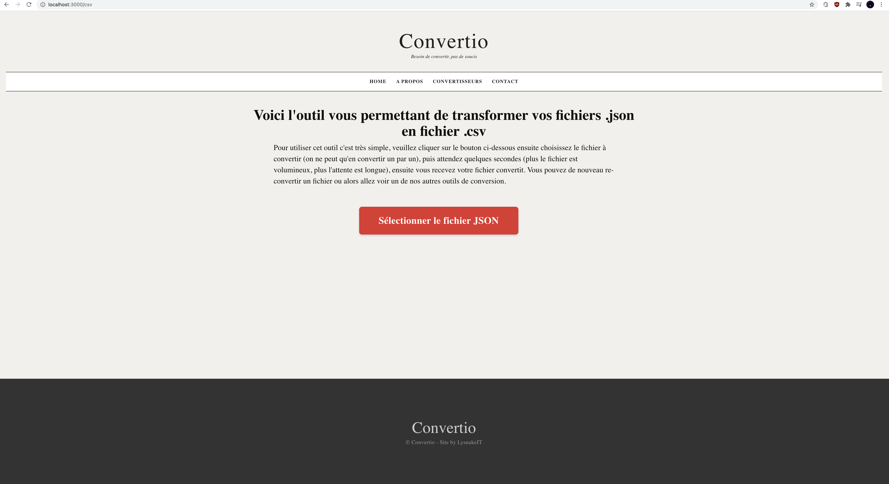
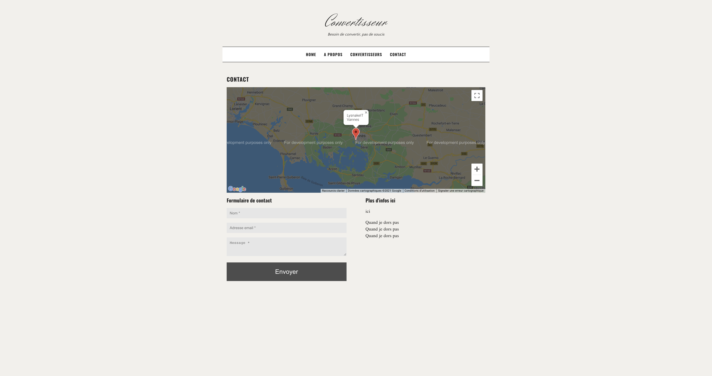

---

<p align="center">
  
</p>

---
# Convertisseur (Convertisseur web)
> Convertisseur est une application web local permettant de convertir certains types de fichier vers un autre type, tels que la conversion de :
> - PNG --> JPG
> - JPG --> PNG
> - WEBP --> PNG
> - MP4 --> GIF
> - JSON --> CSV
> - Fusionner plusieurs PDF --> un seul PDF


## Table des matières
* [Informations générales](#informations-générales)
* [Technologies utilisées](#technologies-utilisées)
* [Fonctionnalités futures](#fonctionnalités-futures)
* [Screenshots](#screenshots)
* [Installation](#installation)
* [Lancement application](#lancement-application)
* [Contributeurs](#contributeurs)

---

## Informations générales
- Le projet n'est pas terminé, il reste des bugs, et il faut implémenter de nouveaux convertisseurs
- L'application web est en ligne ici :
- Il est possible qu'en fonction de la résolution d'écran le site soit bogué

## Technologies utilisées
Ce projet utilise plusieurs technologies :
- [Express.js](https://expressjs.com/fr/) - Framework application web
- [Jade/Pug](https://pugjs.org/api/getting-started.html) - Moteur de template
- [Node.js](https://nodejs.org/fr/) - Environnement d’exécution

## Fonctionnalités futures
La liste des futures fonctionnalités:
- Convertisseur PowerPoint en PDF
- Convertisseur Excel en PDF

## Screenshots




## Installation

- Télécharger le projet 
```bash
git clone https://github.com/LysnakeIT/Convertisseur.git
```

- Ensuite, ouvrez un terminal à l'endroit où le projet a été cloné, puis faites.
```bash
sh ./install.sh
```

- Ensuite, nous allons installer le projet, pour ce faire faites les commandes ci-dessous.
``` bash
$ cd convert
$ npm install
$ cd ..
$ npm install
```

## Lancement application
- Afin de lancer l'application web, vous devez ouvrir un terminal et vous rendre au niveau de ce README.
- Ensuite taper cette commande dans votre terminal.

```bash
$ npm start
```

- Ensuite rendez-vous à cette adresse : http://localhost:3000/

Pour fermer l'application web retourné dans votre terminal et faites : ``Ctrl+C``

## Contributeurs
- [@KiwiOnIT](https://github.com/KiwiOnIT) - Réalisation des logos de conversion pour la page d'accueil
